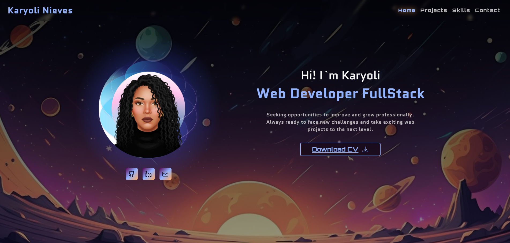
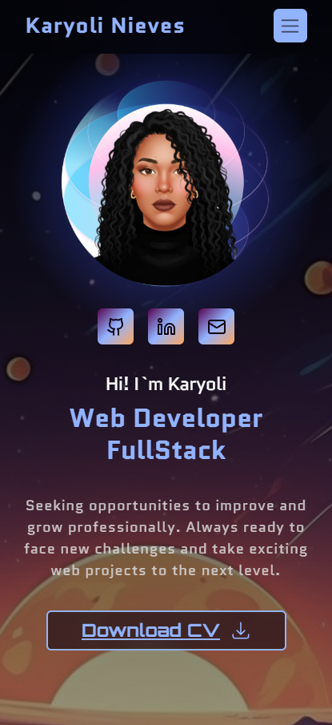

# Karyoli Nieves - Full Stack Developer Portfolio

Welcome to my personal portfolio repository! This website is designed to showcase my skills, projects, and professional experience as a Full Stack Web Developer. It features a modern, responsive design with dynamic interactions to provide an engaging user experience.

<p align="center">
  
  &nbsp;
  
</p>

## 🚀 Overview

This single-page application (SPA) serves as my digital business card and project showcase. It is built with a focus on clean aesthetics, performance, and intuitive navigation.

### Key Features
*   **Dynamic Hero Section:** Custom particle background effect (`particles.js`) for a visual "wow" factor.
*   **Responsive Navigation:** A sticky navbar with ScrollSpy functionality that highlights the current section and a fully functional mobile hamburger menu.
*   **Project Showcase:** Interactive cards that open a detailed modal with project info, technologies used, and links to live demos/code.
*   **Bento Grid Layout:** A modern, grid-based layout for showcasing technical skills and stats.
*   **Contact Form:** Integrated functionality with FormSubmit for direct email communication.
*   **Responsive Design:** Fully optimized for desktops, tablets, and mobile devices using Bootstrap 5 and custom CSS.

## 🛠️ Technologies Used

*   **Logic:** Vanilla JavaScript (ES6+)
*   **Structure:** Semantic HTML5
*   **Styling:** 
    *   CSS3 (Custom properties/variables, Flexbox, Grid)
    *   Bootstrap 5.3 Framework
*   **Libraries:**
    *   `particles.js` (Background animation)
    *   `lucide-icons` and `devicon` (Iconography)

## 📂 Project Structure

```text
miPortfolio/
├── index.html          # Main HTML structure
├── README.md           # Project documentation
└── src/
    ├── assets/         # Images, icons, and PDF resume
    ├── css/            # Stylesheets
    │   ├── base.css    # CSS imports
    │   ├── header.css  # Navbar styles
    │   ├── style.css   # Main/Global styles
    │   └── ...
    └── javaScript/     # Logic files
        ├── index.js    # Main particle logic
        ├── navbar.js   # Custom scrollspy and interaction logic
        └── projects.js # Project data and modal handling
```

## 💻 How to Run Locally

Since this is a static website, you don't need to install complex dependencies or build tools.

1.  **Clone the repository:**
    ```bash
    git clone https://github.com/nkaryoli/miPortfolio.git
    ```
2.  **Navigate to the folder:**
    ```bash
    cd miPortfolio
    ```
3.  **Run the project:**
    *   **Option A (Recommended):** Use the "Live Server" extension in VS Code.
    *   **Option B:** Simply double-click `index.html` to open it in your default web browser.

## 🌟 Featured Projects

The portfolio includes detailed comparisons and links for my key projects:
*   **GreenDev:** Sustainable Development Hub (MERN Stack).
*   **Nk-QrCode:** QR code generator and customizer.
*   **Qraft:** Digital identity & QR Badge Platform (Hackathon Winner).
*   **Mussic Kids:** Interactive Online Music School.

## 📬 Contact

Feel free to reach out to me for collaboration or opportunities!

*   **Email:** karyoli.ie@gmail.com
*   **LinkedIn:** [Karyoli Nieves](https://www.linkedin.com/in/karyoli-nieves/)
*   **GitHub:** [@nkaryoli](https://github.com/nkaryoli)


